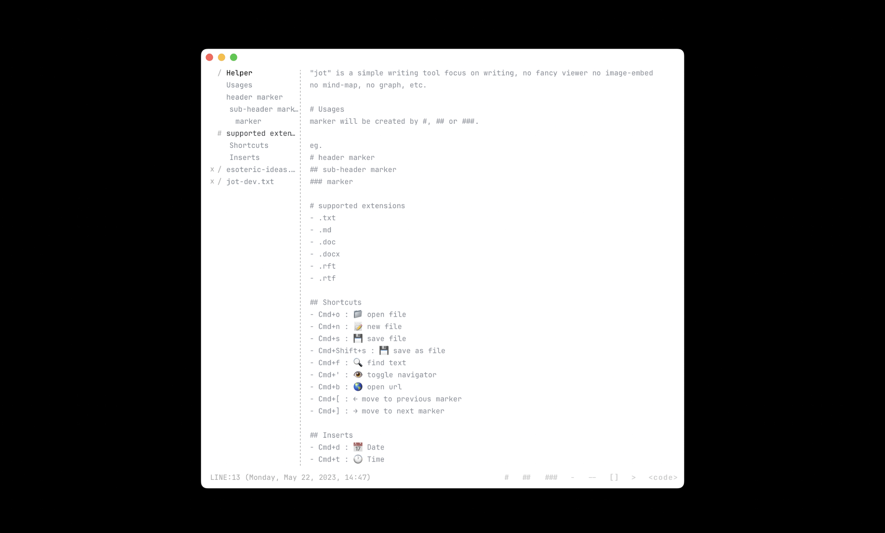
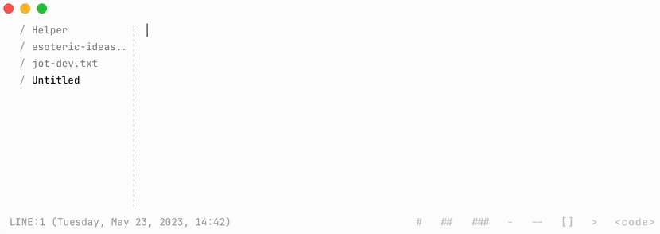
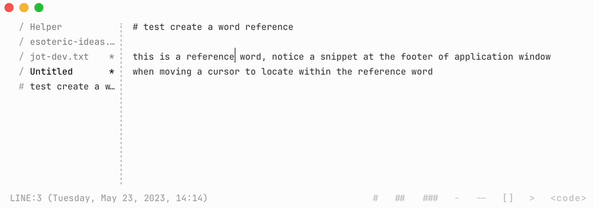

# `jot`

"jot" (จด), a simple writing tool focus on writing, no fancy viewer, no image-embed, no mind-map, graph, etc. inspired by the a simplicity of [TextEditor](https://support.apple.com/en-ae/guide/textedit/welcome/mac), and an intuitive distractionless of [Left](https://github.com/hundredrabbits/Left). Powered by [Tauri](https://tauri.app), a framework for building tiny, blazingly fast binaries for all major desktop platforms.

# features

- small app size (~3mb)
- writing-focus only
- quick inserts

# usages

- 

marker will be created by <code>#</code>, <code>##</code> or <code>###</code>. eg. <code>`# header marker`</code>, or <code>## sub-header marker</code> or <code>### marker</code> for quickly navigate between header.

- 

for reference word(eg. <code>word¹</code>), use <code>^</code> follow by any number eg. <code>word^1</code> and type <code>Cmd+Shift+6</code> (make sure the cursor is within the target word) will be converted to <code>word¹</code> and append reference to the end of the file.

# build

- `pnpm i`, install deps first
- `pnpm run build`, built file will be located at `src-tauri/target/release/bundle/<depends-on-your-os>`

# development

- `pnpm run dev`

## shortcuts

- `Cmd+o` : open file
- `Cmd+n` : new file
- `Cmd+s` : save file
- `Cmd+Shift+s` : save as file
- `Cmd+f` : find text
- `Cmd+'` : toggle navigator
- `Cmd+b` : open url
- `Cmd+[` : move to previous marker
- `Cmd+]` : move to next marker
- `Cmd+Shift+6` : convert to footnote superscript

## inserts

- `Cmd+d` : Date
- `Cmd+t` : Time
- `Cmd+p` : Path
- `Cmd+h` : Header¹
- `Cmd+H` : Sub-Header¹
- `Cmd+/` : Comment

¹will create marker at navigator
